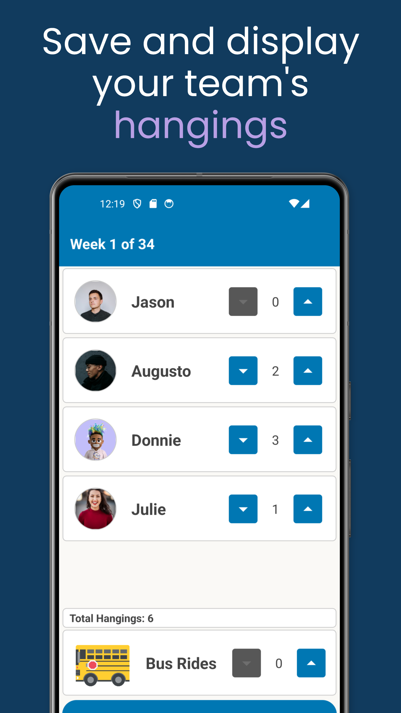
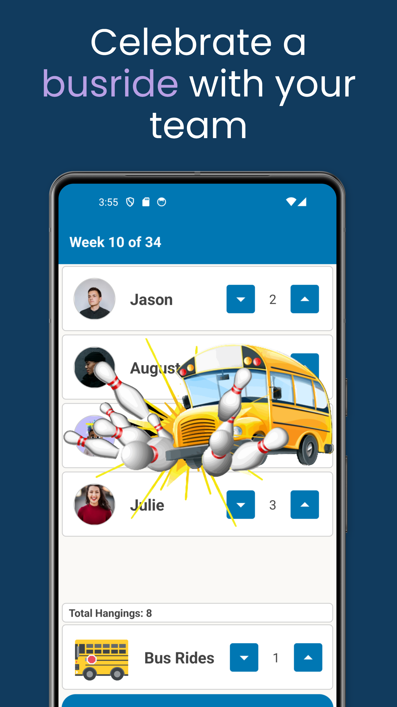
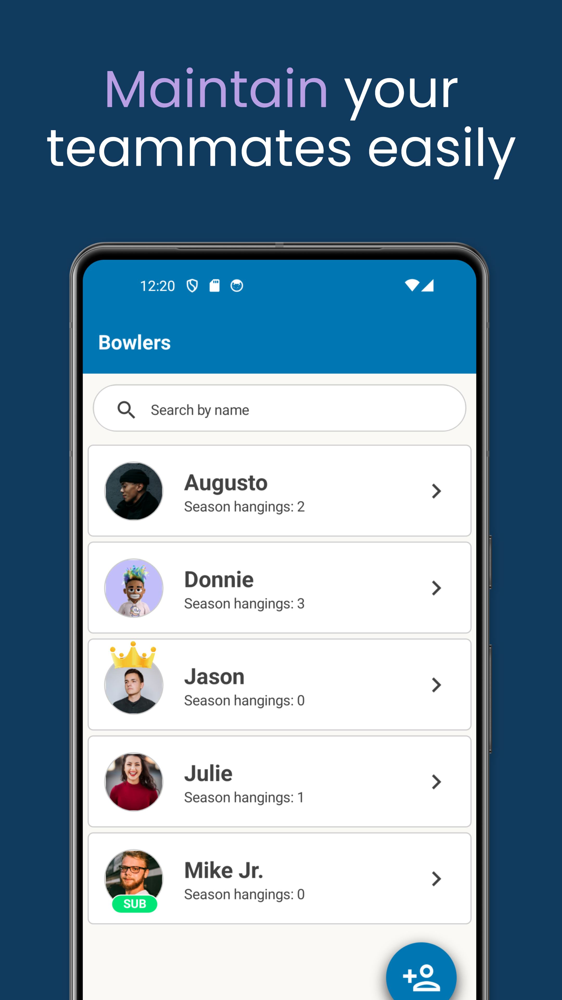
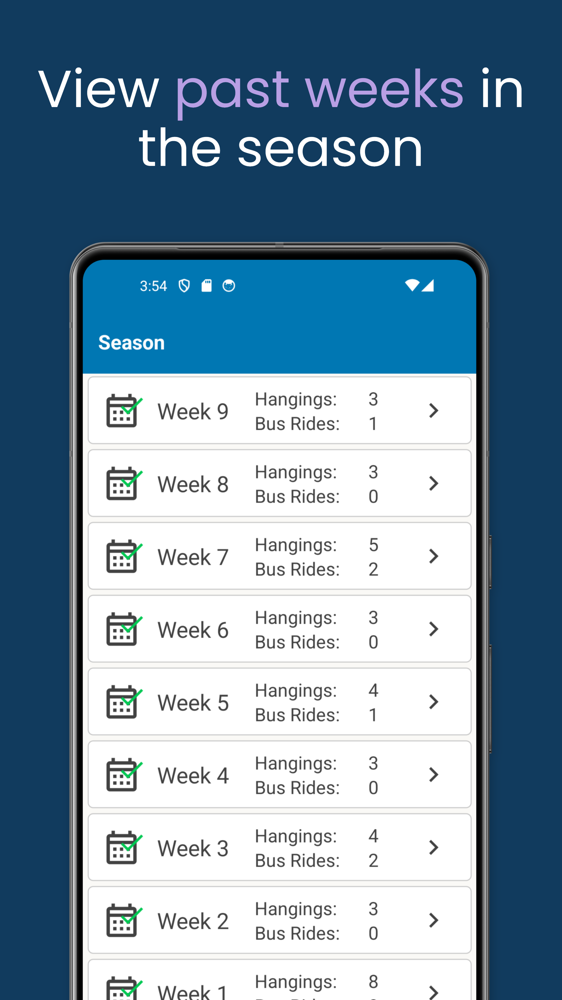
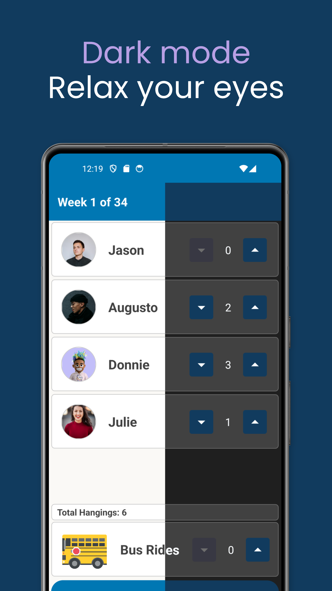

# HangTab

A simple MAUI app that records bowling 'hangings' and 'bus rides' for a team.

    

**Notes:**
- A 'hanging' is when all bowlers BUT ONE strike, that bowler is then 'hung'.

- A 'bus ride' is when ALL bowlers strike in the same frame (no bowler is 'hung').
